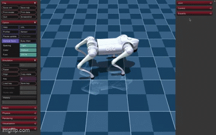
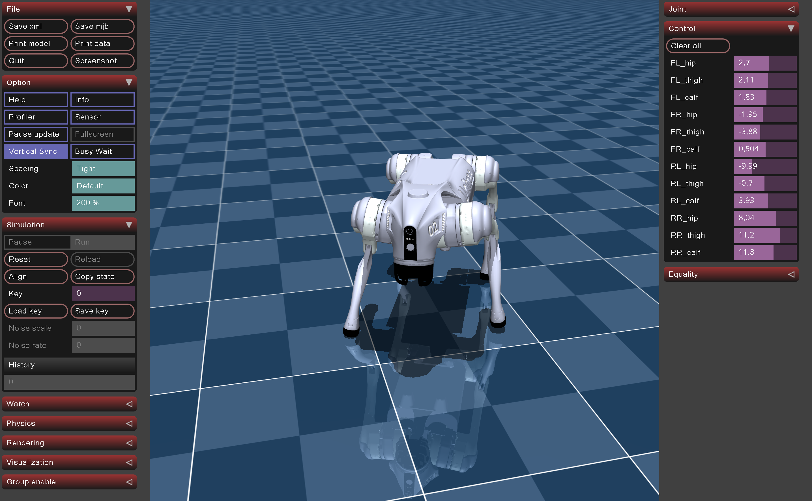

# Quadruped Walking and Behaviour Cloning

This repository contains simulation scripts for controlling a quadruped robot in a physics-based environment. The project demonstrates both **rule-based walking** and **behaviour cloning** using reinforcement learning and imitation learning techniques.

---

  

---

## 🐾 Overview

### `simple_walk_quad.py`
Implements a **basic walking controller** for a quadruped robot.  
- Generates a simple gait pattern using pre-defined joint angles or sinusoidal motion.  
- Demonstrates fundamental walking behaviour and leg coordination.  
- Serves as a baseline for more advanced locomotion models.

### `behaviour_cloning_go2.py`
Implements **behaviour cloning** for a Unitree Go2-style quadruped robot.  
- Trains a model to imitate expert walking behaviour from demonstration data.  
- Uses neural networks to map robot states (joint positions, velocities) to motor commands.  
- Demonstrates how imitation learning can produce stable and efficient locomotion.

---

## 📸 Demonstrations

### Screenshot
Below is a snapshot of the quadruped walking in simulation:

### Video Demonstration
Watch the simulation demo here:  
[🎥 Video Demonstration]( Unitree_Recording_turn.mov)

---

## ⚙️ Requirements

- Python 3.8+
- Mujoco
- NumPy  
- PyTorch or TensorFlow  
- Matplotlib (optional, for visualization)

